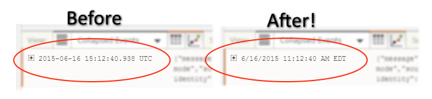

# IMPORTANT ANNOUNCEMENT
*As of August 3, 2015, Loggly directly supports displaying timestamps in local time so this Chrome extension is now obsolete.  I am leaving the repository up for historical reference and because it makes a decent starting point for a simple Chrome extension that inspects and manipulates a specific sites's DOM.*

Please see the Loggly announcement here for more details:
https://www.loggly.com/blog/announcing-local-timezone-support/

### Introduction

Timestamp Localizer for Loggly is an extension for Google Chrome that converts timestamps on Loggly.com from UTC to the browser's local time.  For whatever reason, the people behind Loggly have not provided this functionality directly from Loggly despite years of users requesting this feature so this extension seeks to fill that gap. 

This is a very preliminary version of this extension.  Bugs and oddities are to be expected!

### Installing

Currently, this extension is not available on the Chrome Web Store.  To use this extension, you must install it manually using Developer mode as documented by Google [here](https://developer.chrome.com/extensions/getstarted). 

1. In Chrome, open Settings -> Extensions.
2. Enable the "Developer mode" checkbox.
3. Click "Load unpacked extension..." and navigate to the 'extension' subfolder from this repository. 

If you wish to make changes to the code, simply press the Reload button for the extension on the Settings page to reload your changes.  
